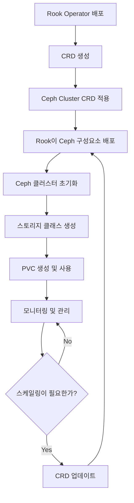

오늘은 **PV 동적 프로비저닝 관리 도구**인 **Rook-Ceph**의 채택 사유 대해 설명해드리려고 합니다.

기존에는 PV를 파드에 할당 시키기 위해 해당 파드가 존재하는 노드의 디렉토리를 직접 설정했는데, 이 디렉토리 경로를 yaml 상에선 'hostPath'로 명세합니다. 호스트 PC에 실재하는 디렉토리 경로를 사용하기 때문에, 초기 구현이 쉽다는 장점이 있습니다. 그러나 이러한 방식은 두 가지 문제점이 있습니다.

첫 번째는 **'보안'**입니다. 호스트 PC의 루트 디렉토리 예하의 디렉토리 및 파일들에 접근하는 방식이기 때문에, 직접적으로 접근한다는 점에 있어 보안상의 문제가 우려됩니다.

두 번째는 **'작동 오류 시 특정 파드로의 올바른 PV 연결 불가'**입니다. 만약 어떠한 문제가 발생하여 파드 혹은 노드에 작동 오류 발생 시, 파드의 desired value 유지를 위해 쿠버네티스가 해당 파드를 재가동합니다. 이때, 만약 다중 클러스터 환경에서 이러한 문제가 발생 했다면, 문제가 발생했던 파드에 해당 파드가 똑같이 재생성 될 것이라는 보장이 없습니다. 물론, yaml내 설정을 통해 특정 노드에 고정적으로 파드가 생성되도록 할 수도 있지만, 만약 특정 노드가 재기 불가능한 문제가 발생한다면, 해당 노드가 복구될 때 까지 해당 파드는 사용할 수 없을 수 있다는 단점이 있어 실시간으로 desired value를 유지하려는 저희의 지향하는 바와는 다소 거리가 먼 방법입니다. 이때 만약 원래 사용되던 파드가 다른 노드에 배치될 경우, 해당 파드는 기존 노드의 hostPath와 연결되도록 설정되어 있기에, 정상 작동되지 않습니다.

이 뿐만 아니라 서버 관리자라면 '비효율적인 저장소 할당 방법'이라는 점도 있습니다. PV를 파드가 사용하기 위해선 반드시 이를 요청하기 위한 영구 저장소 요청(Persistent Volume Claim, 이하 PVC)가 적용되어야 합니다. 이때 하나의 PVC엔 단 하나의 PV만 연결되기 때문에 만약 수십 명의 학부생들에게 독자적인 공간을 제공해주려면 그 많은 파드, PV, PVC를 직접 하나하나 할당시켜주어야 합니다. 이는 최초 환경 조성, 향후 서버 관리 측면에도 상당히 불편하며, 비효율적입니다.

요약하자면, 원활한 저장소 환경 관리를 위해 필요한 일들은 다음과 같습니다.

1. **호스트 PC의 디렉토리에 직접적인 접근이 없는 저장소 할당**
2. **관리자의 원시적인 PV 할당 지양**
3. **파드 혹은 노드의 비정상적인 종료 이후에도 올바른 PV 할당**

1, 3번 문제를 해결하기 위해선 클러스터 전범위로 적용되는 파일 시스템이 필요합니다. 또한 각 PV에 대한 상태를 모니터링 하며, 리소스의 작동 오류에도 올바른 저장소에 연결해주는 시스템도 구축되어야 합니다.

2번 문제를 해결하기 위해선 저장소가 동적으로 할당되는, 즉 동적 프로비저닝(Dynamic Proviosioning)이 필요합니다. 관리자가 새로운 파드 생성, 혹은 기존 파드 삭젫 인해 생기는 PV 관리 문제를 직접 해결하지 않고 오직 PVC의 유무 만으로 PV 생성 여부가 결정되는 시스템이 필요합니다.

앞서 언급된 문제들을 해결할 수 있는 방법이 바로 **'Rook과 Ceph을 활용하는 것'**입니다.

Rook은 **오픈소스 클라우드 네이티브 스토리지 오케스트레이션 도구**입니다. 이와 더불어 사용되는 Ceph은 **오픈소스 분산 스토리지 시스템**으로, Rook을 통해 Ceph을 통해 생성된 저장소 객체를 관리합니다.

Rook-Ceph의 Management Flow는 하단의 이미지와 같습니다.

## Rook-Ceph Management Flow

위의 과정을 통해 Rook이 Ceph에서 정의된 가상의 리소스들을 관리하여 관리자가 요구한 상태(Desired State)를 유지하도록 도와줍니다.

다음 글은 Rook-Ceph의 구성요소에 대해 설명드리겠습니다. 읽어주셔서 감사합니다!!!
