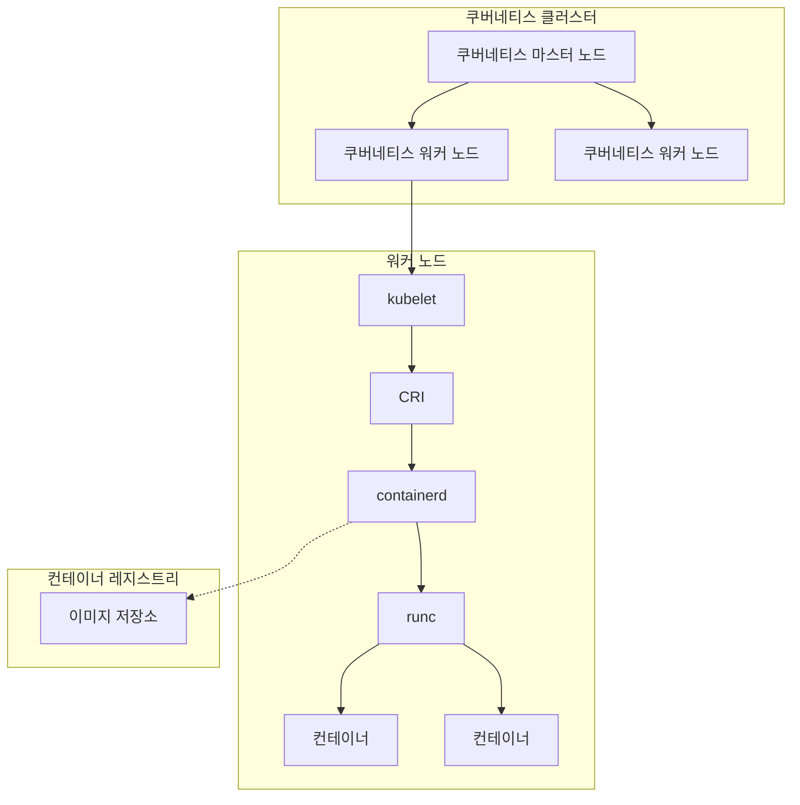

안녕하세요! 오늘은 마이크로서비스와 Docker에 대하여 간단하게 용어 설명해드리려고 합니다.

최근 들어 사용자에게 제공되는 서비스들은 주로 **'마이크로서비스 아키텍처(Microservice Architecture)'**라는 특성으로 제공됩니다. 마이크로서비스에 대해 설명하기에 앞서, 기존에 있던 방식인 **모놀리틱(Monolithic) 방식**에 대해 설명드려야겠죠?

모놀리틱 구조란 기존의 전통적인 웹 시스템 개발 스타일로, 하나의 애플리케이션 내에 모든 로직들이 들어가있는 방식을 이야기합니다. 모놀리틱 구조의 특징은 다음과 같습니다.

### **모놀리틱 구조 특징**

1. **call-by-reference** : 각 컴포넌트들은 상호 호출 함수를 이용하는 구조
2. **간편한 개발 및 배포** : 전체 애플리케이션을 개발툴 등을 이용하여 하나의 애플리케이션으로 개발, 배포, 테스트 진행
   → 이에 따라 **규모가 작은 애플리케이션은 배포 및 운영 관리가 용이**

하지만 **긴 빌드 및 배포 시간, 협업의 어려움, 구조 및 특성의 이해 어려움 등 하나의 애플리케이션이 대용량 서비스로 전환되는 경우** 발생하는 문제점이 너무 많기 때문에, 이렇게 많은 요소들을 최소한의 단위로 나누어 개발하는 것이 바람직할 것이라는 아이디어에서 시작된 것이 바로 마이크로서비스입니다.

## **마이크로서비스 구조 (Microservice Architecture)**

애플리케이션을 느슨하게 결합된 서비스의 모임으로 구조화하는 서비스 지향 아키텍쳐(Service Oriented Architecture, 이하 SOA)의 일종인 소프트웨어 개발 스타일입니다. 마이크로서비스의 특징은 다음과 같습니다.

### **마이크로서비스 특징**

1. **서비스 분리** : 각 기능을 독립적인 서비스로 분리하여 개발 및 배포
2. **독립적 배포** : 각 서비스를 독립적으로 배포할 수 있어 유연성이 높음
3. **기술 다양성** : 각 서비스에 적합한 기술 스택 선택 가능
4. **API 통신** : 서비스간 통신이 주로 API를 통해 진행
5. **확장성** : 필요한 서비스만 선택적으로 확장 가능
6. **장애 격리** : 한 서비스의 문제가 전체 시스템에 미치는 영향을 최소화
7. **팀 자율성** : 각 서비스를 담당하는 팀을 독립적으로 운영 가능

이렇게 모든 서비스를 최소한의 단위로 나누어 개발하다 보니, 각 서비스에 대한 독립적인 환경이 조성되고, 여기서 파생되는 개발, 배포 등에서의 편의성이 많이 보장되는 구조가 형성되기 때문에 아직까진 '마이크로서비스는 정확히 이런 방식으로 운영된다'라는 정확한 정의는 없지만, 많은 회사들이 마이크로서비스 구조를 채택하려 하고 있고, 이미 채택하고 있기도 합니다. (대표적인 예시: **구글의 '보그(Borg)'**)

마이크로서비스 구현을 위해서는 '컨테이너(Container)'라는 개념이 수반됩니다. 컨테이너란 애플리케이션과 그 실행에 필요한 모든 종속성(라이브러리, 바이너리, 설정 파일 등)을 하나의 패키지로 묶은 소프트웨어 유닛입니다. Linux를 기준으로 컨테이너를 OS 상에서 사용하기 위해선 기존에는 도커를 이용하여 **Dockerfile**을 생성한 뒤, 이 파일을 **이미지로 빌드(build)**하고, **도커를 통해 해당 이미지를 실행시키면 비로소 해당 이미지가 컨테이너가 되어 애플리케이션이 실행**되는 방식이었습니다.

그러나, 2021년 8월에 쿠버네티스 v1.22가 배포된 이후로 쿠버네티스에서의 도커 지원은 중단되었습니다. 정확히는 도커의 컨테이너 런타임을 사용할 수 없게 되었는데, 그 이유는 쿠버네티스를 이용한 여러 운영 방안들이 채택되면서 그에 맞는 컨테이너 런타임들이 생겨나게 되었는데, 이때 여러 컨테이너 런타임과 통신할 수 있도록 하는 **'CRI(Container Runtime Interface)'**라는 표준 인터페이스가 도입되었기 때문입니다.

도커의 경우 CRI 탄생 이전에 만들어진 기술이었기 때문에, 이와 호환되지 않았고, 도커를 최대한 CRI에 맞춰 활용하고자 하드코딩하여 만든 도커와 CRI사이의 징검다리 역할인 **'dockershim'**도 만들어졌었지만, 쿠버네티스의 **'kubelet'**자체에 불필요한 복잡성을 초래하는 도커에 의존적인 코드들이 많이 만들어지면서 여러 컨테이너 런타임이 문제없이 돌아가게 하고자 한 쿠버네티스의 오픈소스 철학과 맞지 않아 결국 지원을 중단하게 되었습니다.

(하지만 여전히 이미지를 빌드 및 관리하는 등, 도커 자체적인 기능은 사용중이기 때문에, 도커는 절대 배제하면 안되는 기술입니다 😤)

따라서 현재 컨테이너를 쿠버네티스 환경에서 사용할 땐 다음과 같은 과정을 거치게 됩니다.

클러스터 환경의 마스터 노드에 특정 애플리케이션 사용에 대한 요청이 들어오면, 이 작업은 워커 노드에게 전달되고, 해당 노드의 kubelet이 CRI와 통신하여 적절한 컨테이너 런타임을 선택하고, 컨테이너 런타임은 이미지 레지스트리에서 요청된 애플리케이션이 담긴 이미지를 가져와 runc를 이용하여 해당 이미지를 컨테이너로써 실행시키게 됩니다.

컨테이너 가상화가 적용된 호스트 PC의 모식도는 다음과 같습니다.
{: width="500" height="500" }

여기까지 마이크로서비스 및 도커에 대한 전반적인 설명이었습니다. 긴 글 읽어주셔서 감사합니다!!! 😌
